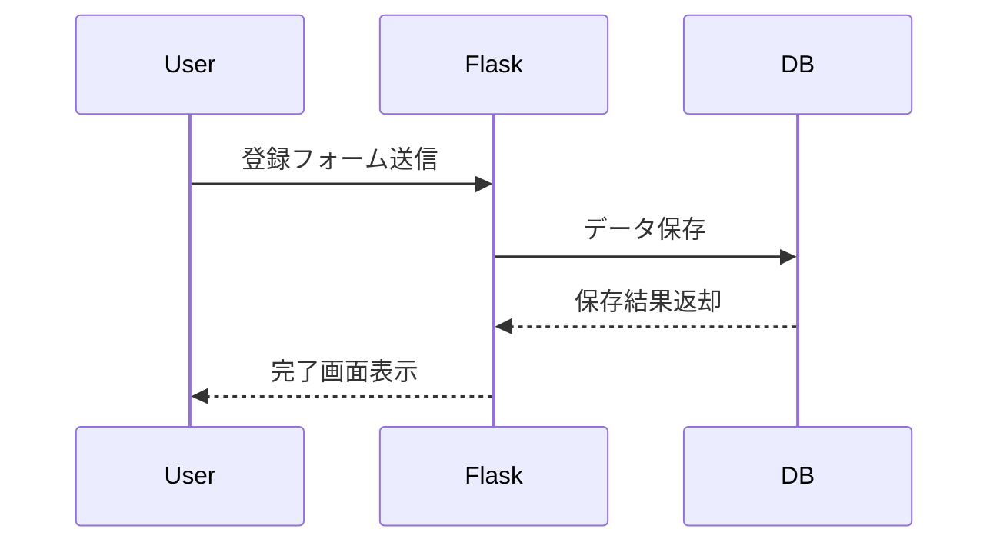
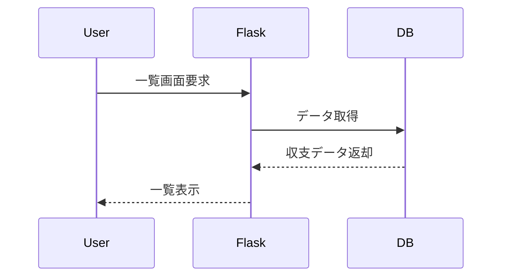
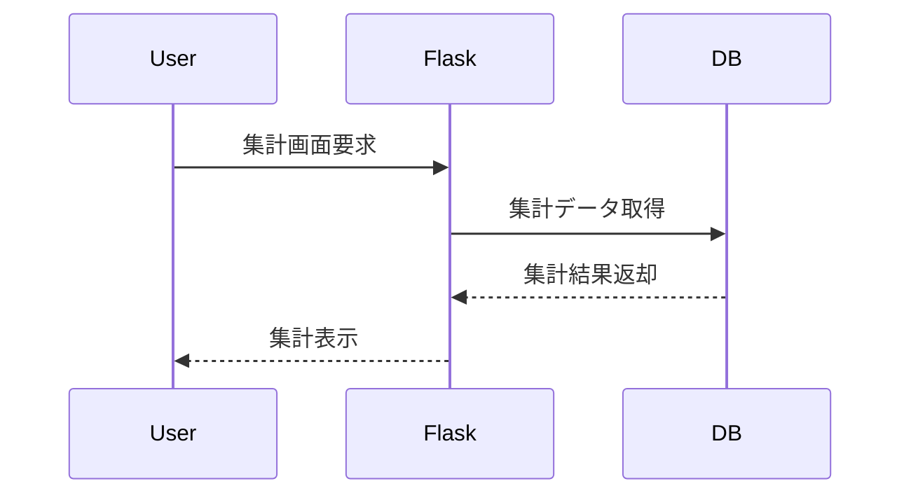

# 家計簿アプリ 基本設計書
## カラー設計
- メインカラー: #005B47
- サブカラー: #B3D056

## 1. システム構成

## 2. 画面設計
### 2.1 ホーム画面
- 月ごとの収支・収入合計表示
- 収支・収入登録へのリンク
- 収支一覧へのリンク

### 2.2 収支・収入登録画面
- 入力項目: 日付、カテゴリ、金額、メモ、種別（支出/収入）
- 登録ボタン

### 2.3 収支一覧画面
- 登録済みの収支・収入を一覧表示
- 編集・削除ボタン
- 並び替え（カテゴリ・日付）

### 2.4 集計画面
- 月ごとの収支・収入合計
- カテゴリごとの合計金額

## 3. データベース設計
### 3.1 テーブル: entries
| カラム名   | 型         | 説明             |
|------------|------------|------------------|
| id         | INTEGER    | 主キー           |
| date       | DATE       | 日付             |
| category   | TEXT       | カテゴリ         |
| amount     | INTEGER    | 金額             |
| memo       | TEXT       | メモ             |
| type       | TEXT       | 支出/収入        |

## 4. シーケンス図（Mermaid）
### 4.1 収支・収入登録

### 4.2 収支一覧表示

### 4.3 集計表示

## 5. API設計（例）
- POST /entry: 収支・収入登録
- GET /entries: 収支一覧取得
- PUT /entry/{id}: 収支・収入編集
- DELETE /entry/{id}: 収支・収入削除
- GET /summary: 集計データ取得

## 6. その他
- 入力チェック（必須項目、数値チェック等）
- シンプルなUIデザイン
- Bootstrapを用いたレスポンシブな画面設計
