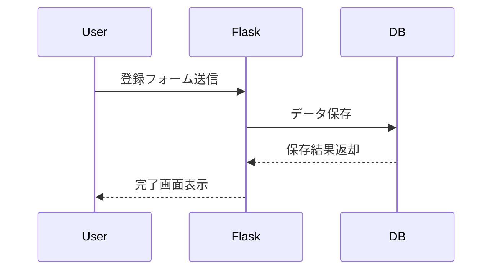
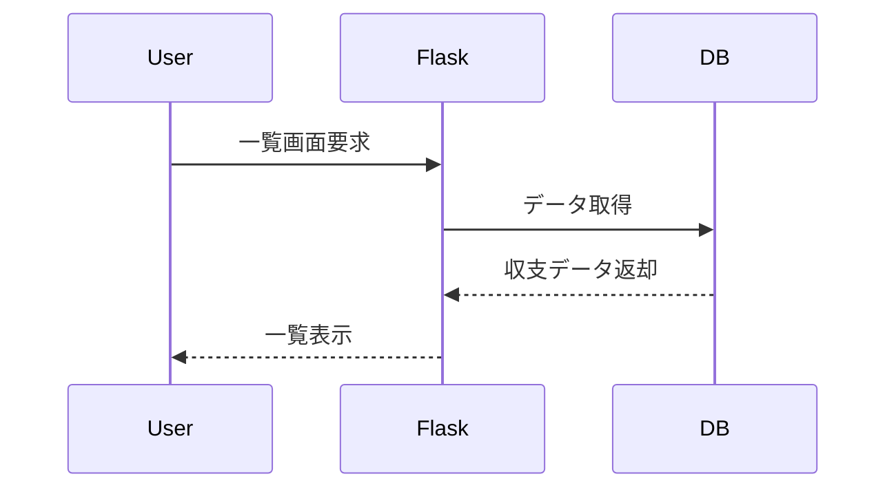
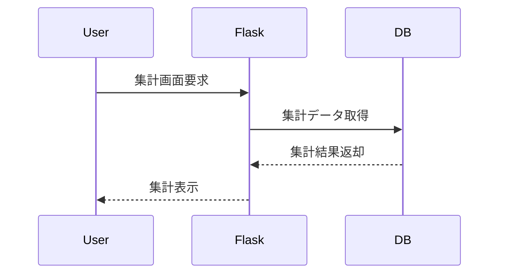

# 家計簿アプリ 詳細設計書
## カラー設計
- メインカラー: #005B47
- サブカラー: #B3D056

## 1. 画面設計
### 1.1 ホーム画面
- 月ごとの収支・収入合計表示
- 収支・収入登録ボタン
- 収支一覧ボタン

### 1.2 収支・収入登録画面
- 入力フォーム（Bootstrapフォーム使用）
  - 日付（date型）
  - カテゴリ（select）
  - 金額（number）
  - メモ（text）
  - 種別（ラジオボタン：支出/収入）
- 登録ボタン

### 1.3 収支一覧画面
- 一覧テーブル（Bootstrapテーブル使用）
- 編集・削除ボタン
- 並び替え機能（カテゴリ・日付）

### 1.4 集計画面
- 月ごとの合計表示
- カテゴリごとの合計表示

## 2. API設計
| メソッド | パス | 機能 | パラメータ | 戻り値 |
|----------|------|------|------------|--------|
| POST | /entry | 収支・収入登録 | date, category, amount, memo, type | 成功/失敗 |
| GET | /entries | 収支一覧取得 | なし | 収支データ一覧 |
| PUT | /entry/{id} | 収支・収入編集 | id, date, category, amount, memo, type | 成功/失敗 |
| DELETE | /entry/{id} | 収支・収入削除 | id | 成功/失敗 |
| GET | /summary | 集計データ取得 | なし | 月・カテゴリ集計結果 |

## 3. DB設計
### 3.1 entriesテーブル
| カラム名   | 型         | 説明             |
|------------|------------|------------------|
| id         | INTEGER    | 主キー           |
| date       | DATE       | 日付             |
| category   | TEXT       | カテゴリ         |
| amount     | INTEGER    | 金額             |
| memo       | TEXT       | メモ             |
| type       | TEXT       | 支出/収入        |

## 4. 処理フロー（Mermaid）
### 4.1 収支・収入登録

### 4.2 収支一覧表示

### 4.3 集計表示

## 5. バリデーション
- 必須項目チェック
- 金額は数値のみ
- 日付は未来日不可

## 6. UI設計
- Bootstrapを用いたレスポンシブデザイン
- シンプルで見やすい配色・レイアウト
